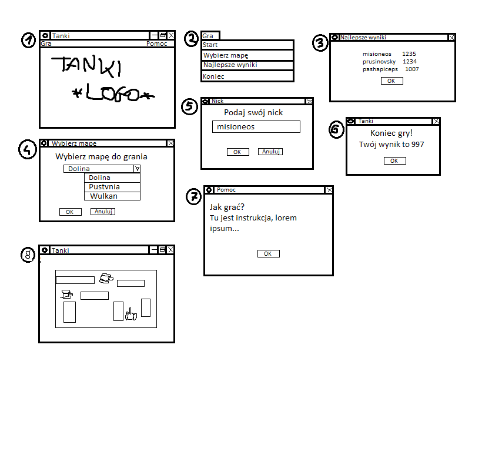

# PROZE20L_Prusinowski_Sołdacki

### Gra Tanki (Dyna Blaster)

W oknie otwierającym aplikacji jest pasek menu i plansza z poziomem gry (1). Opcje do wyboru to Gra (2), która jest rozsuwanym menu i Pomoc (7), która jest wyskakującym okienkiem z instrukcją jak grać. W menu Gra są do wyboru opcje: Start, Wybierz mapę (4) , Najlepsze wyniki (3) i Koniec. Start powoduje pojawienie się okienka Nick (5), które wymaga od gracza wpisania swojego nicku. Gdy nie będziemy chcieli wpisać nicku, gra wróci nas do ekranu startowego.

W samej grze poruszamy się czołgiem po mapie-labiryncie, a głównym celem jest zniszczenie innych czołgów i znalezienie bazy przeciwnika. Część bloków labiryntu jest niezniszczalna, a część jest podatna na pociski czołgu. Niszcząc inne czołgi ułatwiamy wejście do bazy przeciwnika, a wejście skutkuje zmianą poziomu na następny. Gracz ma 3 życia. Punkty w grze będzie określał wzór zawierający czas przejścia mapy, ilość zniszczonych czołgów, ilość zniszczonych bloków i pozostałe życia. W razie przejścia wszystkich poziomów, gra zacznie się od nowa, ale punkty wciąż będą się dodawały do licznika. 

Wraz z końcem gry wyskakuje okienko (6), na którym jest pokazany wynik gracza. Opcja OK bądź zamknięcie powoduje przejście do ekranu startowego.

Pozostałe opcje z menu Gra to Wybierz mapę, które daje nam opcję, od którego poziomu chcemy zacząć i Najlepsze wyniki, które ukazuje listę nicków i ich wyniki. Na liście będzie znajdować się tylko 5 lub 10 najlepszych wyników, które będą pobierane i zapisywane do pliku tekstowego. Opcja Koniec zamyka program. 

